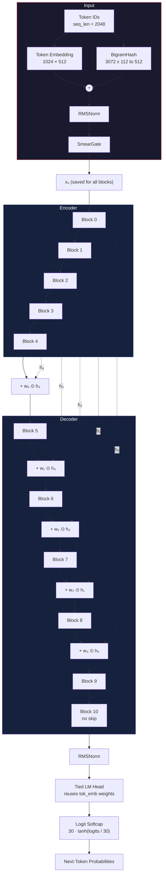
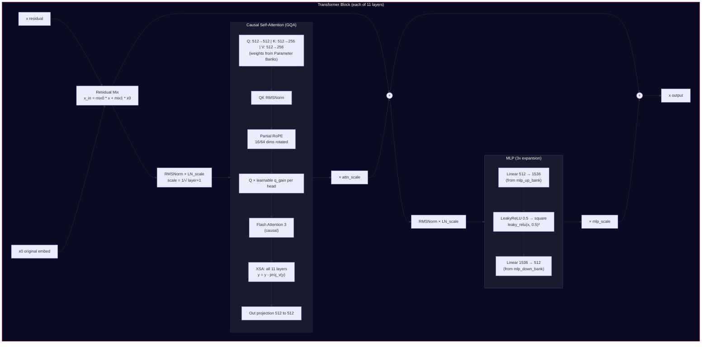
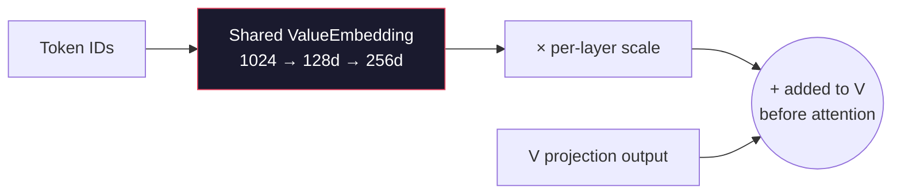
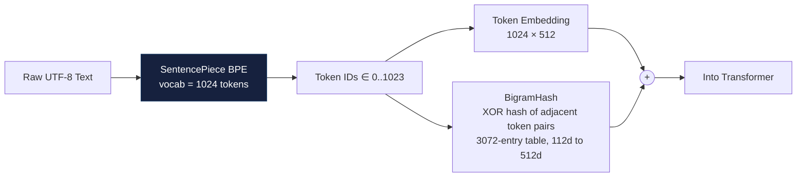
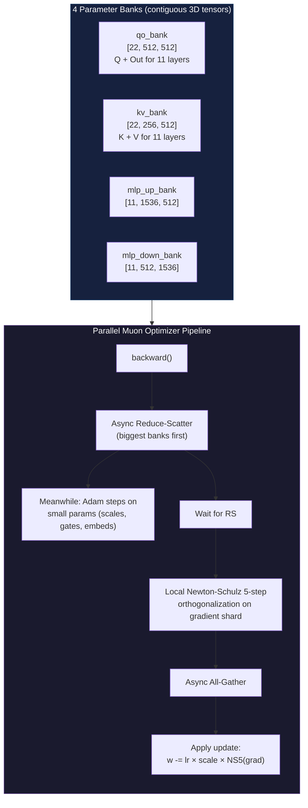
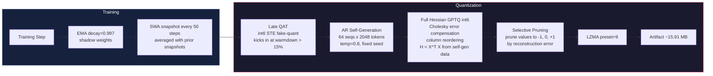

# Current SOTA Architecture — Parameter Golf Leaderboard

**Submission**: AR Self-Gen GPTQ + XSA-all + BigramHash 3072x112
**Score**: 1.1147 BPB (3-seed mean, std 0.0004)
**Author**: abaybektursun | **Date**: 2026-03-25
**Artifact Size**: ~15.91 MB (limit: 16 MB)
**Previous SOTA**: 1.1194 BPB (PR #549, same author) | **Improvement**: -0.0046 BPB

---

## Model Card

| Property | Value |
|----------|-------|
| Type | Autoregressive causal LM (next-token prediction) |
| Context length (train) | 2048 tokens |
| Context length (eval) | 2048 tokens (sliding window, stride 64) |
| Vocabulary | 1024 BPE tokens (SentencePiece) |
| Tokenization | Byte-pair encoding via SentencePiece |
| Model dimension | 512 |
| Layers | 11 (U-Net: 5 encoder + 6 decoder) |
| Attention heads | 8 (head_dim = 64) |
| KV heads | 4 (Grouped Query Attention) |
| MLP expansion | 3x (hidden = 1536) |
| Tied embeddings | Yes (tok_emb reused as lm_head) |
| Positional encoding | Partial RoPE (16 of 64 dims) |
| Attention impl | Flash Attention 3 (causal) |
| Precision | BF16 training, int6 QAT, Full Hessian GPTQ int6 + LZMA preset=9 |
| Training hardware | 8x H100 SXM 80GB |
| Training time | 600s (~6,922 steps at 86.7ms/step) |
| Eval time | Standard sliding window only (no TTT) |
| TTT | Dropped (neutral/negative on this stack) |

---

## Architecture Overview

### Forward Pass Formulas

**Input Processing:**
```
x = TokenEmbed(ids) + BigramHash(ids)
x = SmearGate(RMSNorm(x))
x₀ = x                                ← saved, fed into every block via residual mixing
```

**Encoder (layers 0–4) — each layer saves its output:**
```
h₀ = Block₀(x, x₀)
h₁ = Block₁(h₀, x₀)
h₂ = Block₂(h₁, x₀)
h₃ = Block₃(h₂, x₀)
h₄ = Block₄(h₃, x₀)
```

**Decoder (layers 5–10) — skip connections added in reverse order:**
```
x  = Block₅( h₄ + w₀⊙h₄,  x₀)       ← skip from layer 4
x  = Block₆(  x + w₁⊙h₃,  x₀)       ← skip from layer 3
x  = Block₇(  x + w₂⊙h₂,  x₀)       ← skip from layer 2
x  = Block₈(  x + w₃⊙h₁,  x₀)       ← skip from layer 1
x  = Block₉(  x + w₄⊙h₀,  x₀)       ← skip from layer 0
x  = Block₁₀( x,           x₀)       ← no skip (6 decoders > 5 encoders)
```

**Output:**
```
logits = 30 · tanh( Linear(RMSNorm(x)) / 30 )       ← Linear reuses tok_emb weights
```

`w₀..w₄` are learnable 512-dim vectors (per-feature skip scaling).
`x₀` enters every block via residual mixing: `x_in = mix₀·x + mix₁·x₀`.

### U-Net Skip Connection Structure

The encoder and decoder layers are paired in reverse order, forming a U-shape.
Deep decoder layers receive shallow encoder features, and vice versa:

```
Encoder                                                    Decoder
───────                                                    ───────
Layer 0  ─── h₀ ──────────────────────────────── +w₄⊙h₀ → Layer 9
  ↓                                                          ↑
Layer 1  ─── h₁ ────────────────────────── +w₃⊙h₁ ────→ Layer 8
  ↓                                                          ↑
Layer 2  ─── h₂ ──────────────────── +w₂⊙h₂ ──────→ Layer 7
  ↓                                                          ↑
Layer 3  ─── h₃ ────────────── +w₁⊙h₃ ────────→ Layer 6
  ↓                                                          ↑
Layer 4  ─── h₄ ──────── +w₀⊙h₄ ──────────→ Layer 5
  ↓                ↑
  └──── main path ─┘                          Layer 10 (no skip)
                                                   ↓
                                                Output
```

### Full Architecture (Mermaid)



---

## Transformer Block Detail



---

## Value Embedding Injection (Layers 9-10 only)



---

## Tokenization Pipeline



---

## Parameter Banks & Parallel Muon Optimizer



---

## Weight Averaging & Quantization



### AR Self-Generated GPTQ (key innovation)

The previous SOTA used GPTQ-lite (diagonal Hessian approximation). This submission uses **Full Hessian GPTQ** — a strictly better quantizer with Cholesky error compensation and column reordering.

The problem: Full Hessian GPTQ needs calibration data to compute `H = X^T X`. Prior attempts used training data, which was ruled illegal after the 600s training window.

The solution: **the model generates its own calibration data**. After training completes, it autoregressively generates 64 sequences of 2048 tokens (temperature=0.8). No validation data, no training data accessed during quantization. This is fully self-contained.

### TTT: Dropped

The previous SOTA (PR #549) used Test-Time Training for -0.0025 BPB. On this new stack, TTT was tested 25+ times and found **neutral or negative**. The Full Hessian GPTQ improvement more than compensates.

---

## What Changed from Previous SOTA (PR #549, 1.1194 BPB)

| Change | Previous (1.1194) | Current (1.1147) | Impact |
|--------|-------------------|-------------------|--------|
| **Quantization** | GPTQ-lite (diagonal Hessian) | Full Hessian GPTQ with AR self-gen calibration | Major improvement |
| **XSA** | Last 4 layers only | All 11 layers | Free quality (zero params) |
| **BigramHash** | 1536 x 128 | 3072 x 112 | Wider table, slightly narrower dim |
| **TTT** | Score-first TTT (-0.0025 BPB) | Dropped (neutral on this stack) | Simplifies eval |
| **Selective pruning** | No | Yes (prune to -1, 0, +1 by reconstruction error) | Better compression |
| **Warmdown** | 3500 iters | 4000 iters | Slightly longer cooldown |
| **Compression** | LZMA | LZMA preset=9 | Max compression |

### Lineage

```
PR #549 (1.1194) — Parallel Muon + LeakyReLU² + Legal TTT
    └── PR #1019 (1.1147) — This work adds:
        ├── AR self-gen Full Hessian GPTQ (no external data during quantization)
        ├── BigramHash 3072 x 112
        ├── XSA on all 11 layers (from PR #478)
        ├── Selective pruning to -1, 0, +1 (from PR #609)
        ├── Warmdown 4000, LZMA preset=9
        └── Dropped TTT (25+ failed experiments, PR #756)
```